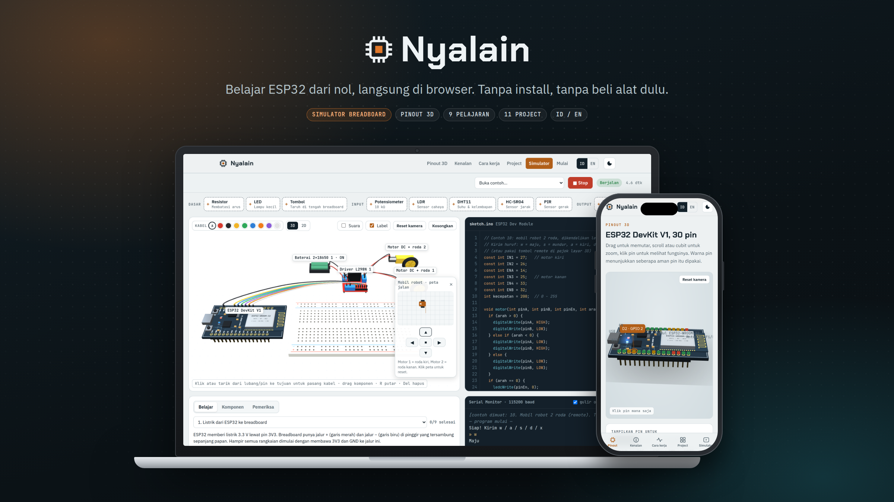

# ESP32 Lab 3D

[](https://zakycahyohadi.github.io/learn-esp32/)

**Learn the ESP32 in your browser — no board, no wiring kit, no install.**

👉 **Open it here: https://zakycahyohadi.github.io/learn-esp32/**

ESP32 Lab 3D is a free, interactive learning tool for anyone starting out with the ESP32 and Arduino. You can spin a 3D board to learn its pins, watch how WiFi, ADC and PWM work, follow step-by-step lessons, and build real circuits on a virtual breadboard that actually runs your Arduino code.

It's made for students, teachers, and hobbyists who want to understand *why* a circuit works before buying parts — or who want to practice without the risk of burning a component.

Available in **English** and **Bahasa Indonesia** (toggle ID/EN in the top-right corner, switches instantly).

---

## What you can learn

| Section | What it teaches |
|---|---|
| **3D Pinout** | An ESP32 DevKit V1 (30 pins) you can rotate. Click any pin to see its function, GPIO number, and whether it's safe to use. |
| **How it works** | 3D animations of WiFi (Station & Access Point), ADC (reading analog values), and PWM. |
| **11 Projects** | LED, button, PWM, DHT11, HC-SR04, PIR, web server, WiFi temperature monitor, relay, servo, and DC motor with L298N. Each comes with a parts list, wiring table, Arduino code, and an **Open in simulator** button. |
| **Learn from zero** | 9 guided lessons: electricity & breadboards → LED + resistor → blink → button → `analogRead` → PWM → DHT11 sensor → motors with L298N → a 2-wheel robot car. Every step is checked automatically, with hints and an answer button. Your progress is saved. |
| **Simulator** | A 400-point breadboard with 15 components. Place parts, draw wires, write code, and run it. |

## The simulator

The simulator is the heart of the lab. It isn't just a drawing — circuits are actually evaluated electrically:

- A wrong wire means the device won't work.
- An LED without a resistor can burn out.
- Includes a Serial Monitor, a hover multimeter, and a circuit checker to help you debug.
- 3D or 2D top-down view.
- 11 ready-made examples, including a remote-controlled 2-wheel robot car (on-screen buttons or W A S D).

Jump straight in: https://zakycahyohadi.github.io/learn-esp32/#simulator

**Supported code:** most beginner Arduino C++ — variables, functions, `if`/`for`/`while`/`switch`, arrays, `String`, `Serial`, `delay`, `millis`, `analogRead`, `ledcAttach`/`ledcWrite`, `pulseIn`, plus the `DHT` and `ESP32Servo` libraries.

**Not yet supported:** `class`/`struct`, advanced pointers, and other libraries. WiFi is simulated (it always "connects").

## Moving to real hardware

The example code targets the **esp32 by Espressif v3.x** board package in the Arduino IDE, so what you write in the lab can be uploaded to a real ESP32. The site includes a setup guide for the Arduino IDE.

## Run it locally

The page loads its parts with `fetch()`, so it needs a small local server. Double-clicking `index.html` won't work.

**While editing**, serve the source folder directly (no build needed):

```bash
python3 -m http.server 8000
```

**To see the published version** (prerendered pages, guide pages, sitemap), build it first. Node.js 18+ is enough, no `npm install`:

```bash
node tools/build.mjs     # writes the finished site to _site/
node tools/check.mjs     # checks links, JSON-LD, titles and descriptions
cd _site && python3 -m http.server 8000
```

Then visit http://localhost:8000. GitHub Actions runs the same two commands on every push and deploys `_site/`.

## Pages for search engines

`tools/build.mjs` turns the single-page app into pages Google can read without running JavaScript:

- `/` and `/en/`: the home page with its text already in the HTML. The ID/EN buttons still swap the language instantly and also switch the address.
- `/project/<slug>/` and `/en/project/<slug>/`: a guide for each of the 11 projects (parts, wiring, full code, how it works, common problems, a button that opens it in the simulator).
- `/belajar/<slug>/` and `/en/learn/<slug>/`: a page for each of the 9 lessons.
- `/jebakan-esp32/` and `/en/esp32-pitfalls/`: an article about common ESP32 pitfalls.
- `sitemap.xml`, `robots.txt`, canonical and hreflang links, Open Graph tags and JSON-LD on every page.

Project and lesson data come straight from `js/main.js`, `js/sim.js` and `examples/`. Extra text for these pages lives in `content/`.

## Project structure

The code is split by purpose so it's easy to read and learn from:

```
index.html              Page shell: <head>, CDN scripts, and an empty #app-root
css/
  main.css              Styles for the main page
  sim.css               Styles for the simulator
js/
  app.js                Start here: loads the language files and wires up the page
  main.js               Main page logic: 3D pinout, animations, projects, language switching
  sim.js                The simulator: breadboard, wires, circuit solver, Arduino interpreter
lang/
  id/main.html          Main page content in Indonesian
  en/main.html          Main page content in English
  id/sim.html           Simulator layout in Indonesian
  en/sim.html           Simulator layout in English
examples/
  id/*.ino              Arduino code for the 11 projects (Indonesian comments)
  en/*.ino              The same code with English comments
content/
  site.mjs              Shared labels, home page title and description
  projects.mjs          Extra text for each project guide page
  lessons.mjs           Extra text for each lesson page
  pitfalls.mjs          The ESP32 pitfalls article
tools/
  build.mjs             Builds the published site into _site/
  check.mjs             Checks the build (links, JSON-LD, meta tags)
img/og.jpg              Preview image for search results and social media
.github/workflows/
  pages.yml             Builds, checks and deploys the site on every push to main
```

How the two languages work:
- `lang/id/` and `lang/en/` hold the same HTML with translated text. The two files must keep the same element structure, because the language switch swaps the text node by node without reloading the page. When you edit one, make the same change in the other.
- Text generated from JavaScript is written as pairs, `_L('Indonesian', 'English')`, inside `js/main.js` and `js/sim.js`.
- The `.ino` files open directly in the Arduino IDE, so you can upload them to a real ESP32.

Notes:
- Uses [three.js](https://threejs.org) r128 from a CDN, so an internet connection is required.
- Your circuits and lesson progress are stored in your browser's `localStorage`.

## Contributing

Found a bug, a wrong pin description, or have an idea for a new lesson or project? Use the **feedback form** at the bottom of the website, or open an issue or pull request — contributions are welcome.

---

## 🇮🇩 Bahasa Indonesia

**ESP32 Lab 3D** adalah media belajar ESP32 gratis yang berjalan langsung di browser, tanpa perlu install apa pun dan tanpa perlu punya board.

👉 **Buka di sini: https://zakycahyohadi.github.io/learn-esp32/**

Di sini kamu bisa:

- **Mengenal pin ESP32** lewat board 3D yang bisa diputar dan diklik.
- **Melihat cara kerja** WiFi, ADC, dan PWM lewat animasi.
- **Mencoba 11 project**, dari LED sampai motor DC, lengkap dengan daftar alat, tabel kabel, dan kode Arduino.
- **Belajar dari nol** lewat 9 pelajaran bertahap yang dicek otomatis, sampai bisa membuat mobil robot 2 roda.
- **Merakit di simulator breadboard** yang benar-benar menjalankan kode Arduino. Kabel yang salah membuat alat tidak jalan, dan LED tanpa resistor bisa rusak, persis seperti aslinya.

Cocok untuk pelajar, guru, dan siapa saja yang ingin belajar elektronika dan pemrograman ESP32 sebelum membeli komponen. Kode contohnya bisa langsung dipakai di ESP32 asli (Arduino IDE, paket board **esp32 by Espressif versi 3.x**).

Tombol **ID/EN** di pojok kanan atas mengganti bahasa tanpa memuat ulang halaman.
